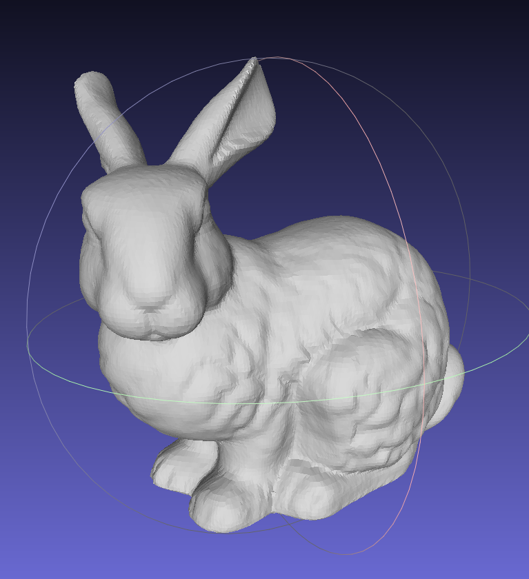
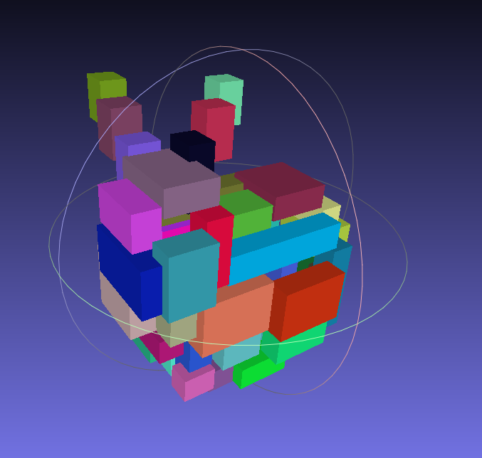
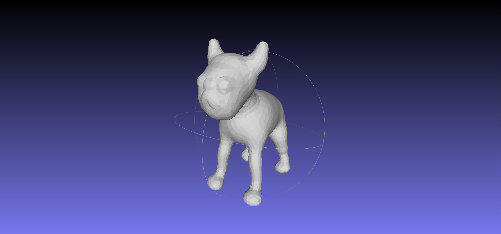
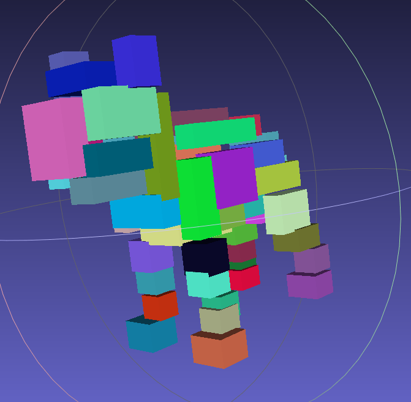
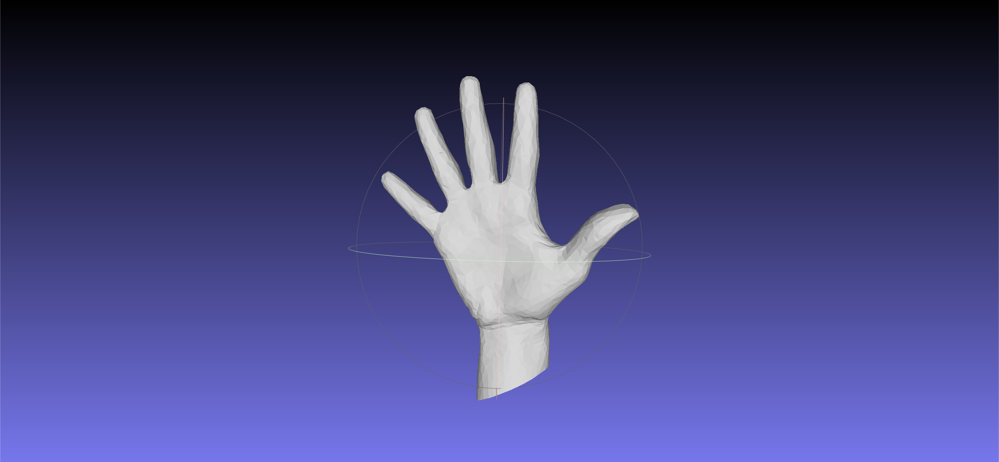
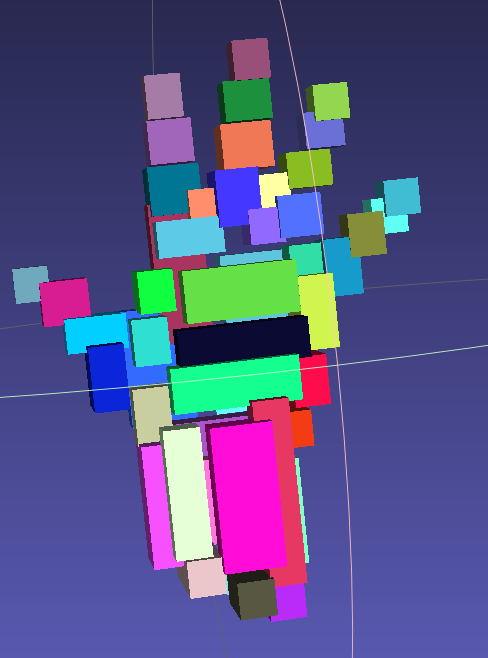
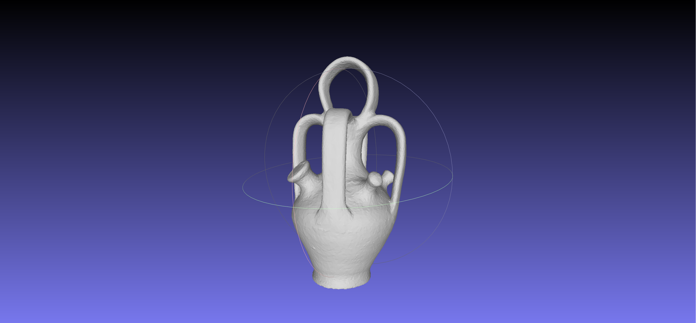
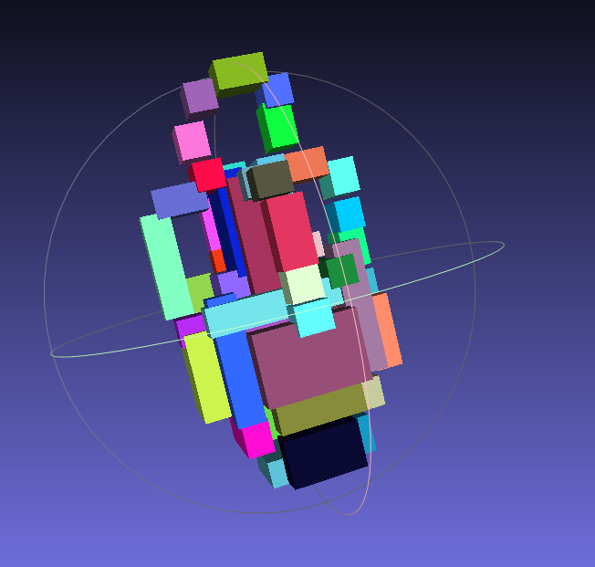
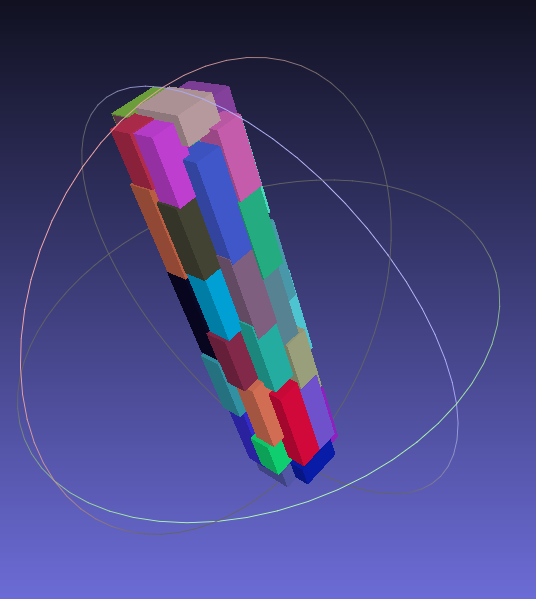

# 3D Primitive Fitting with PointNet

A deep learning approach to fit axis-aligned cuboid primitives to 3D shapes using a PointNet-based architecture.

## Overview

This project implements a neural network that takes 3D point cloud data as input and predicts a set of axis-aligned cuboid primitives that approximate the input shape. The model uses a PointNet encoder to extract global features from point clouds and a decoder to predict primitive parameters (centers and half-sizes).

## Results

| Model | Ground Truth | Predicted Primitives |
|-------|--------------|----------------------|
| Bunny |  |  |
| Dog   |    |    |
| Hand  |   |   |
| Pot   |    |    |
| Rod   |    |    |

## Project Structure

```
├── src/
│   ├── config.py          # Configuration parameters
│   ├── dataset.py         # Data loading and preprocessing
│   ├── model.py           # PointNet encoder and primitive decoder
│   ├── train.py           # Training script
│   ├── infer.py           # Inference script
│   └── utils.py           # Utility functions
├── outputs/               # Model outputs
```

## Model Architecture

### PointNet Encoder
- Takes point clouds of shape `(B, N, 3)`
- Processes through MLP layers: 3 → 128 → 256 → 512 → 1024 → feature_dim
- Uses symmetric max pooling to obtain global features

### Primitive Decoder
- Predicts `NUM_PRIMITIVES` axis-aligned cuboids
- Each cuboid parameterized by:
  - **Center**: `(cx, cy, cz)`
  - **Half-sizes**: `(sx, sy, sz)` (enforced positive via softplus with min size 0.06)

## Installation

```bash
# Create and activate virtual environment
python3 -m venv fit-env
source fit-env/bin/activate

# Install dependencies
pip install torch numpy open3d
```

## Usage

### Training

```bash
cd src
python train.py
```

### Inference

```bash
cd src
python infer.py
```

## Data Format

The model expects data in `.ply` format.

## Checkpoints

Pre-trained model weights are stored in `checkpoints/`:
- `pointnet_primitives.pth` - Trained PointNet primitive fitting model

## Requirements

- Python 3.12+
- PyTorch
- NumPy
- Open3D (for visualization)

## License

This project was developed for CMPT 464.

## Acknowledgments

- PointNet architecture inspired by [Qi et al., 2017](https://arxiv.org/abs/1612.00593)